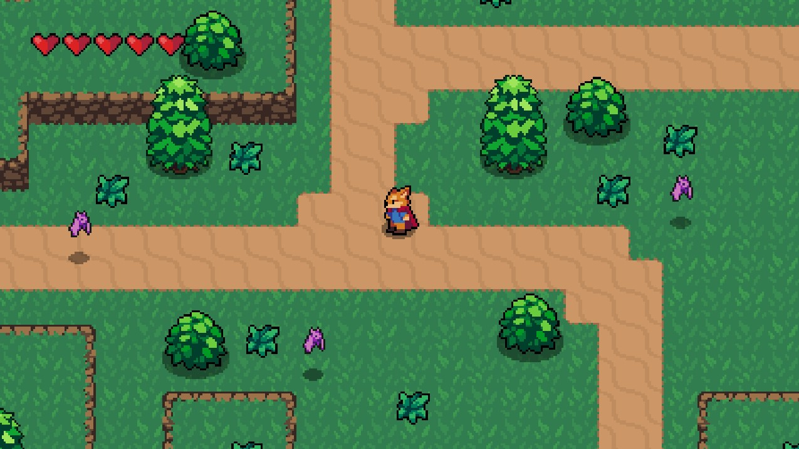

# 🦊 Fox RPG - Godot Learning Project

This is a small-scoped Godot 4.3 project, featuring a top-down RPG-like game, where you play as a little fox avoiding damage from bats and destroying grass. Sounds dangerous! 

The tutorial I followed is an amazing ~8h course made by **Hearbeast**, which you can check out [on his YouTube channel](/https://youtu.be/mAbG8Oi-SvQ?list=PL9FzW-m48fn2SlrW0KoLT4n5egNdX-W9a). 

## 🎮 Features

- Small map made with sprites and tile maps
- Player movement, attacks, dashes
- Audio effects and music
- Animated effects
- State machines for enemies and player
- Attacking the player, invincibility logic

## 📷 Screenshots

